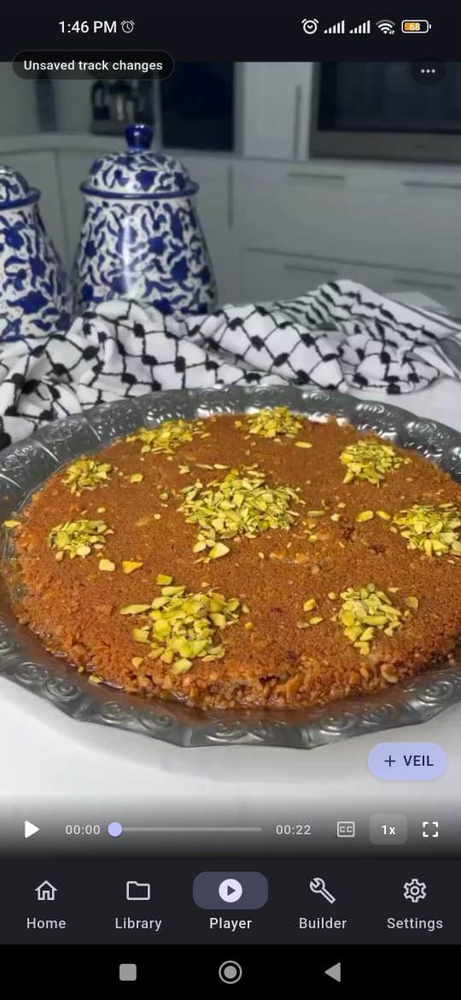

<p align="center">
  
</p>

# VEIL Player Mobile

**VEIL Player Mobile 0.2.3+1**

VEIL Player Mobile is an open-source, **non-normative Android implementation** of the [VEIL Interoperability Specification](https://github.com/allamzedan/veil).

The canonical **VEIL Interoperability Specification 0.1** remains authoritative.
This repository contains an implementation, not normative VEIL material.

- Validated release target: **Android**
- Desktop sibling: [VEIL Player Desktop](https://github.com/allamzedan/veil-player)
- Provider Integration: **Not claimed**

<p align="center">
  
</p>

## What it does

VEIL Player Mobile opens supported local media, reads and writes canonical `.veil` files, and executes supported Skip, Mute, Mask, and Bookmark semantics. It implements local media identity and interoperates with VEIL Player Desktop.

Processing is local and non-destructive. VEIL actions do not alter the source media file.

Flutter scaffolding for other platforms is retained, but those targets have not received the Android release validation described here.

## Capability scope and conformance

VEIL Player Mobile conforms to VEIL Spec 0.1 within its declared capability scope:

- Reader
- Writer
- Playback
- Local Media Identity
- Canonical Validation
- Resource Safety

**Provider Integration is not claimed.** YouTube/provider integration is not supported.

Final VEIL Conformance Corpus 0.1 result:

```text
104 PASS
0 FAIL
9 N/A
0 UNTESTABLE
```

The 9 N/A vectors are Provider Integration vectors outside Mobile's declared capability scope. This is not a claim of 113/113 PASS.

## Build and test

Validated toolchain:

- Flutter 3.44.0 stable
- Dart 3.12.0
- Android compile SDK 36 and target SDK 36
- Gradle 9.1.0
- Android Gradle Plugin 8.11.1
- Kotlin plugin 2.3.20
- Java language level 17

The successful local Android build used a JDK 21 runtime. JDK 21 is not a VEIL requirement; use a JDK compatible with the pinned Flutter/Gradle toolchain.

```bash
flutter pub get
flutter analyze
flutter test
flutter build apk --debug
```

Run the frozen corpus adapter directly with:

```bash
flutter test test/conformance/spec_0_1_harness_test.dart --reporter expanded
```

`pubspec.lock` is committed because this is an application repository.

## Interoperability

Desktop-to-Mobile and Mobile-to-Desktop fixtures are under [`test/fixtures`](test/fixtures).

The Desktop RC2 fixture set documents its provenance and deterministic generation in [`test/fixtures/desktop_rc2/README.md`](test/fixtures/desktop_rc2/README.md).

VEIL Player Desktop is a non-normative Desktop implementation of VEIL.

## Security and privacy

`.veil` files are passive declarative data. VEIL Player Mobile applies canonical validation and resource limits within its declared capability scope.

See the [privacy policy](docs/legal/privacy_policy.md) and [security policy](SECURITY.md).

## Related projects

- [VEIL — canonical interoperability specification](https://github.com/allamzedan/veil)
- [VEIL Player Desktop](https://github.com/allamzedan/veil-player)

## Licensing

VEIL Player Mobile source code and project-owned branding are licensed under the [Apache License 2.0](LICENSE).

Copyright 2026 Allam Zedan.

Public contact: [allamzedan@live.com](mailto:allamzedan@live.com)

The imported frozen VEIL Conformance Corpus 0.1 remains under CC0 1.0 Universal.
See [THIRD_PARTY_NOTICES.md](THIRD_PARTY_NOTICES.md) and the corpus [licensing notice](docs/spec_0_1/conformance/README.md).

Contributions are welcome under [CONTRIBUTING.md](CONTRIBUTING.md). Security reports should follow [SECURITY.md](SECURITY.md).